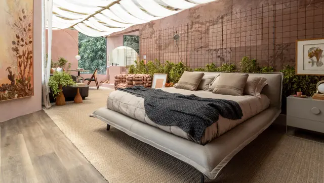
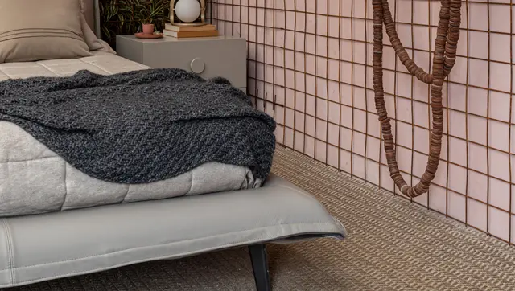
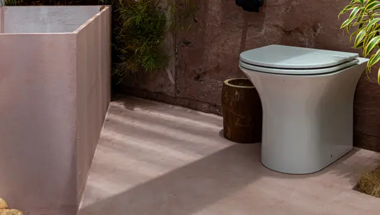
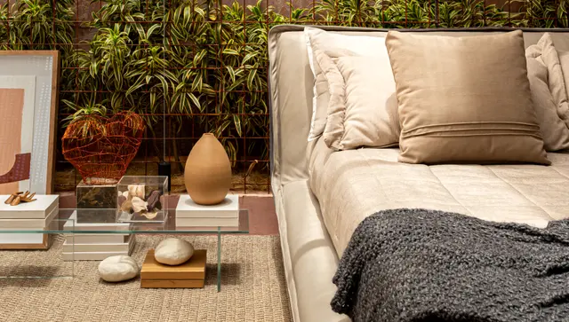
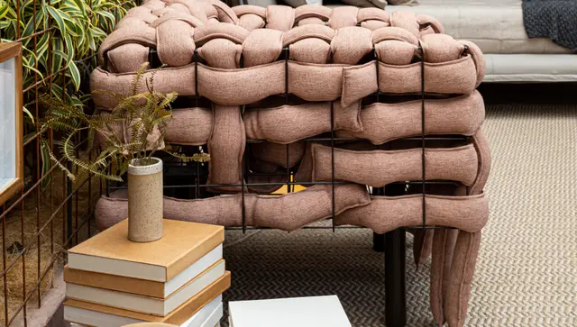

Em meio à agitação do dia a dia, encontrar um espaço que combine aconchego, elegância e funcionalidade é um verdadeiro tesouro. O Bangalô Cravo e Canela, assinado pela arquiteta Jessica Araújo para a CASACOR Bahia 2019, é um desses ambientes que nos transportam para uma atmosfera de tranquilidade sofisticada, onde cada detalhe foi pensado para criar uma experiência sensorial completa.

## A Essência do Bangalô

O projeto se destaca pela harmoniosa combinação de texturas naturais, tons neutros e elementos que remetem à rica cultura baiana, sem cair em clichês. A arquiteta conseguiu traduzir a essência acolhedora de um bangalô tradicional para um contexto contemporâneo, criando um espaço que convida ao relaxamento e à contemplação.

## Materiais e Texturas que Contam Histórias

Um dos pontos altos do ambiente é o uso magistral de materiais naturais. O tapete com trama artesanal cria uma base texturizada que dialoga perfeitamente com as mesas laterais de madeira torneada, cujas bases robustas e topo delicado trazem um interessante contraste de proporções. A presença de plantas com folhagens exuberantes adiciona vida e frescor ao espaço, conectando o interior com a natureza.

A paleta de cores neutras, predominantemente em tons terrosos e cinzas, cria uma atmosfera serena e atemporal. Esta escolha cromática permite que elementos pontuais, como a caixa decorativa dourada e as plantas, ganhem destaque sem comprometer a harmonia do conjunto.

## Mobiliário: Conforto com Personalidade

O mobiliário do Bangalô Cravo e Canela merece atenção especial. O sofá de linhas retas e estofado em tecido texturizado cinza escuro serve como ancoragem visual do ambiente, enquanto as mesas laterais de madeira com design orgânico adicionam movimento e calor ao espaço. A cama, vista em outras perspectivas do ambiente, apresenta linhas limpas e é complementada por roupa de cama em tons neutros que reforçam a sensação de aconchego.

## Detalhes que Fazem a Diferença

O que realmente eleva este projeto a um patamar de excelência são os detalhes cuidadosamente selecionados. A pequena cúpula de vidro abrigando um elemento decorativo natural sobre a mesa lateral é um exemplo perfeito de como pequenos objetos podem adicionar personalidade e refinamento a um espaço. A iluminação, estrategicamente posicionada, cria zonas de conforto e destaca elementos arquitetônicos e decorativos.

## Marcas que Compõem o Cenário

A qualidade do projeto também se reflete nas marcas escolhidas para compor o ambiente. Criare, Baú, Coral, Natuzzi, Artenelle e Lumin são algumas das empresas que contribuíram com peças e acabamentos, garantindo um resultado final impecável tanto em termos estéticos quanto funcionais.

## Inspiração para Sua Casa

O Bangalô Cravo e Canela nos ensina valiosas lições sobre como criar um espaço acolhedor sem abrir mão da sofisticação:

1. Invista em materiais naturais que trazem textura e calor ao ambiente

3. Opte por uma paleta de cores neutras e atemporais como base

5. Escolha móveis que combinem conforto e design

7. Adicione plantas para trazer vida e conexão com a natureza

9. Selecione poucos objetos decorativos, mas que contem histórias e agreguem personalidade

11. Trabalhe a iluminação para criar diferentes atmosferas no mesmo espaço

Este projeto da CASACOR Bahia 2019 continua sendo uma referência inspiradora para quem deseja criar ambientes que sejam verdadeiros refúgios de bem-estar, demonstrando como a arquitetura e o design de interiores podem transformar espaços em experiências sensoriais completas.

Para conhecer mais detalhes e ver outras perspectivas deste incrível projeto, visite o site oficial da CASACOR: [Bangalô Cravo e Canela - CASACOR Bahia 2019](https://casacor.abril.com.br/pt-BR/ambientes/bangalo-cravo-e-canela-bahia-2019)

### Realize o seu Refúgio com a Detaliê Móveis Sob Medida

Um excelente projeto para inspirar sua imaginação. Se você deseja transformar seu lar em um espaço que une funcionalidade, aconchego e estilo pessoal, conte com a **Detaliê Móveis Sob Medida**, especialista em soluções personalizadas de **móveis sob medida em Navegantes e região**.
