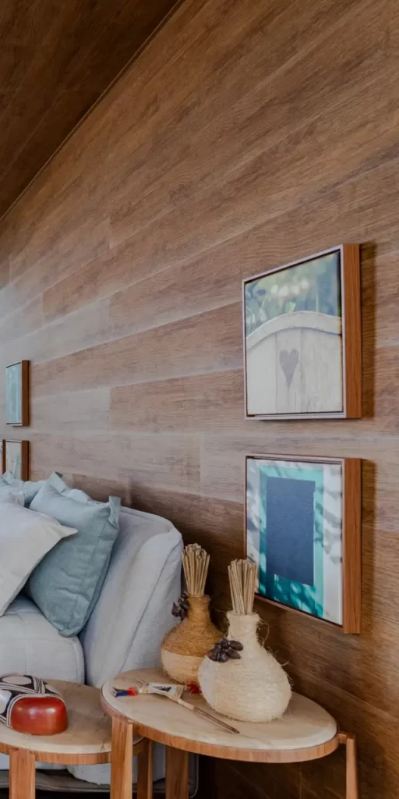
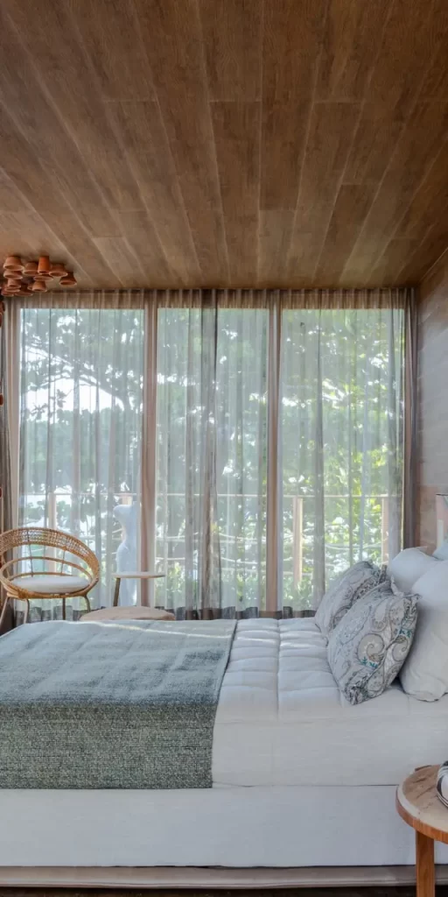
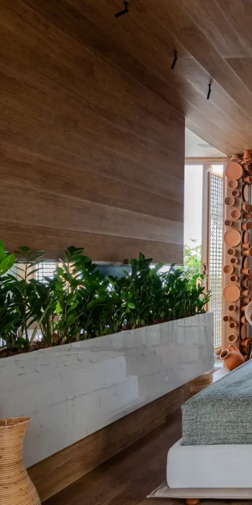
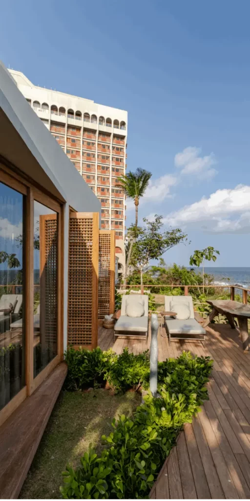
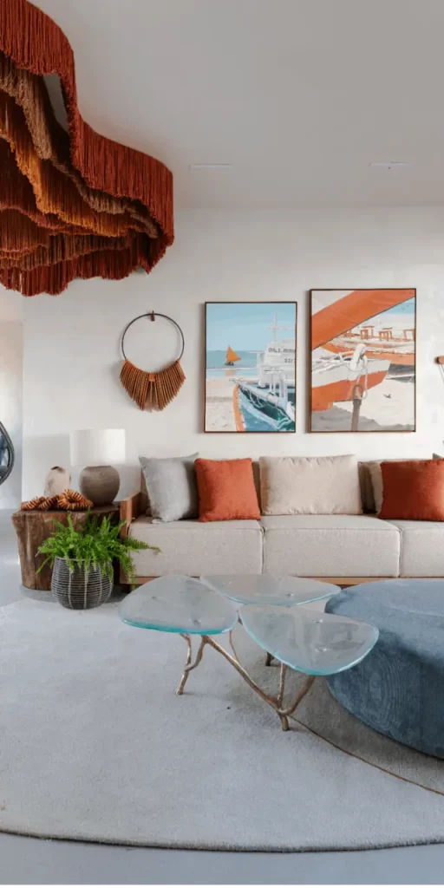
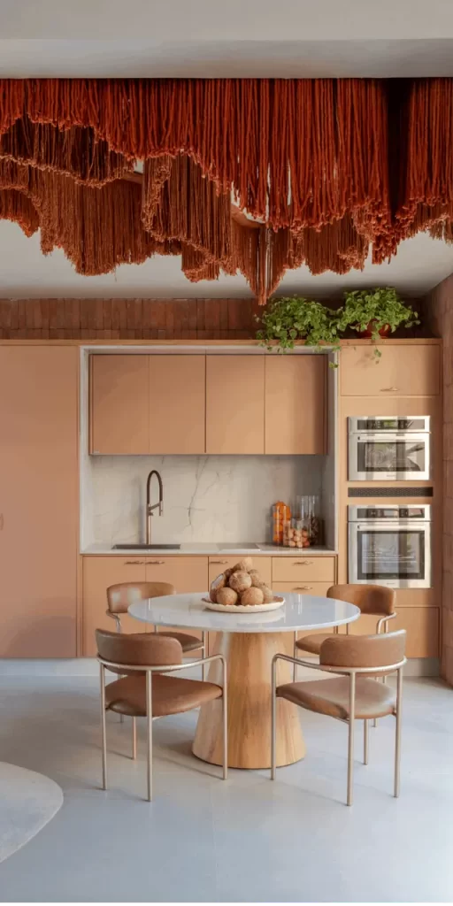
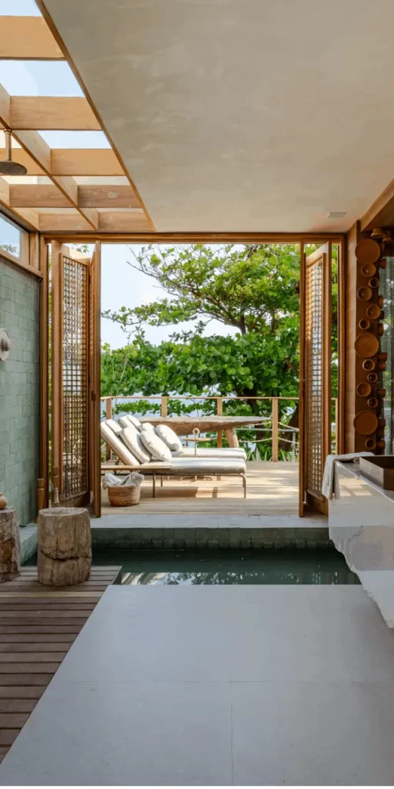

Em um mundo cada vez mais acelerado, encontrar espaços que nos convidam a desacelerar e reconectar com a natureza torna-se um verdadeiro luxo. O Bangalô Terra Mar, assinado pela arquiteta Carol Barreto para a CASACOR Bahia 2024, é uma dessas criações que transcendem o conceito tradicional de habitação para oferecer uma experiência imersiva e transformadora.

## A Essência do Projeto

O Bangalô Terra Mar surge como um convite para viver uma experiência imersiva em um ambiente sofisticado e intimista. A proposta da arquiteta Carol Barreto vai além da simples criação de um espaço habitável – é uma jornada sensorial que celebra a conexão entre o terrestre e o marítimo, entre o concreto e o etéreo.

A edificação foi concebida com linhas simples e espaços abertos, incorporando comodidades modernas que culminam em um deck que se debruça sobre o oceano atlântico. Este posicionamento estratégico não é por acaso: materializa o conceito de "terra mar", criando uma transição fluida entre os dois elementos naturais que inspiram o projeto.

## O Impacto Visual do Teto Escultural

Um dos elementos mais impressionantes do Bangalô Terra Mar é, sem dúvida, o teto escultural. Composto por uma cascata de franjas em tons terrosos que lembram o movimento das ondas, esta instalação artística domina o espaço e cria um efeito visual dramático e acolhedor simultaneamente. As diferentes tonalidades de terracota, laranja e marrom evocam tanto a terra quanto o pôr do sol refletido no mar, unificando o conceito do projeto de forma magistral.

Este elemento não é apenas decorativo, mas transforma completamente a percepção do espaço, criando uma atmosfera envolvente que parece abraçar os visitantes. A luz, ao atravessar as franjas, projeta sombras suaves que dançam pelo ambiente, adicionando movimento e vida ao interior.

## Materiais e Texturas: Um Diálogo com a Natureza

O projeto celebra os materiais naturais em sua forma mais autêntica. A madeira aparece em diferentes aplicações, desde o piso até detalhes do mobiliário, trazendo calor e organicidade ao espaço. As paredes em tons claros servem como tela neutra que permite que os elementos decorativos e arquitetônicos se destaquem.

Vasos de cerâmica em formas orgânicas complementam a narrativa visual, enquanto tecidos em tons neutros adicionam conforto sem comprometer a elegância minimalista do conjunto. A presença de plantas estrategicamente posicionadas reforça o conceito biofílico, trazendo vida e frescor ao ambiente.

## Integração Interior-Exterior

Um dos grandes acertos do projeto é a fluidez entre os ambientes internos e externos. Grandes aberturas emolduradas por esquadrias elegantes permitem que a luz natural inunde o espaço e que a vista para o exterior se torne parte da decoração. O deck mencionado na descrição do projeto não é apenas um anexo, mas uma extensão natural do living, convidando à contemplação do oceano.

Esta integração reforça a filosofia do projeto: não há separação rígida entre o construído e o natural, entre o interior e o exterior – tudo faz parte de uma experiência contínua e harmônica.

## Mobiliário Assinado Breton: Elegância e Funcionalidade

Como sugere o próprio nome do ambiente, todo o mobiliário é assinado pela Breton, marca reconhecida pelo design contemporâneo e pela qualidade excepcional. As peças selecionadas seguem uma linha clean e sofisticada, com formas que privilegiam o conforto sem abrir mão da estética refinada.

O sofá em tom claro, as mesas de apoio e os demais elementos de mobiliário conversam entre si de forma coesa, criando um conjunto harmonioso que serve perfeitamente à proposta do espaço: ser um refúgio sofisticado onde cada detalhe foi pensado para proporcionar bem-estar.

## Marcas que Compõem a Experiência

A qualidade do projeto também se reflete nas marcas escolhidas para compor o ambiente. Elettromec, Todeschini, Tintas Coral e Avatim são algumas das empresas que contribuíram com produtos e acabamentos, garantindo um resultado final impecável tanto em termos estéticos quanto funcionais.

## Inspiração para Projetos Contemporâneos

O Bangalô Terra Mar nos oferece valiosas lições sobre design contemporâneo que podem ser aplicadas em diferentes contextos:

1. A importância de um elemento focal dramático que defina a personalidade do espaço

3. O valor dos materiais naturais na criação de ambientes acolhedores

5. A integração harmoniosa entre interior e exterior

7. O equilíbrio entre minimalismo e expressão artística

9. A incorporação de elementos biofílicos para bem-estar

11. A coerência estética entre arquitetura e mobiliário

Este projeto da CASACOR Bahia 2024 exemplifica como a arquitetura contemporânea pode criar espaços que são simultaneamente funcionais, esteticamente impactantes e emocionalmente acolhedores. É um convite para repensar nossa relação com os ambientes que habitamos e como eles podem proporcionar experiências sensoriais completas.

Para conhecer mais detalhes e ver outras perspectivas deste incrível projeto, visite o site oficial da CASACOR: [Bangalô Terra Mar Uma experiência Breton - CASACOR Bahia 2024](https://casacor.abril.com.br/pt-BR/ambientes/bangalo-terra-mar-uma-experiencia-breton-bahia-2024)

### Realize o seu Refúgio com a Detaliê Móveis Sob Medida

A Estesia Deca é um excelente projeto para inspirar sua imaginação. Se você deseja transformar seu lar em um espaço que une funcionalidade, aconchego e estilo pessoal, conte com a **Detaliê Móveis Sob Medida**, especialista em soluções personalizadas de **móveis sob medida em Navegantes e região**.
