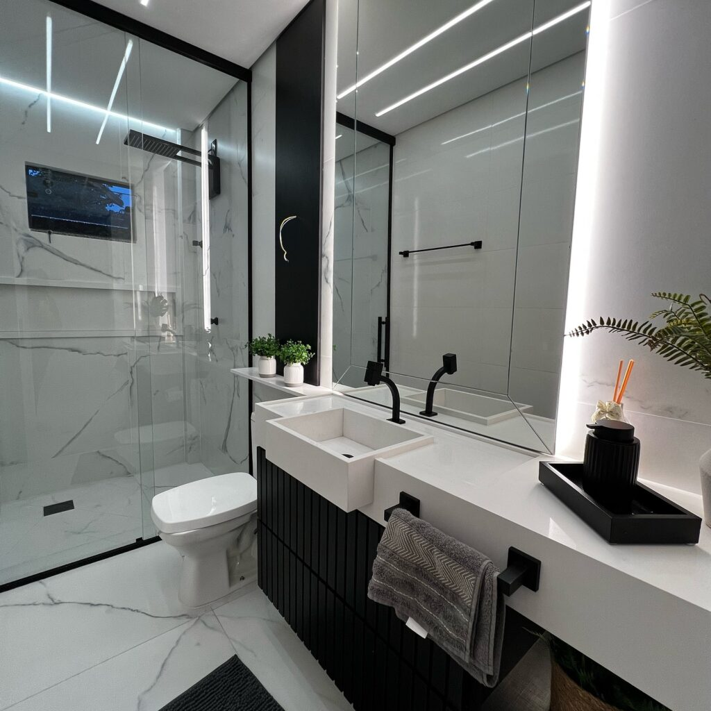

O banheiro deixou de ser apenas um espaço funcional — hoje, ele representa bem-estar, estilo e personalidade. E quando o projeto aposta em **marcenaria preta** com **detalhes ripados**, o resultado é puro requinte.

Em **Navegantes**, cada vez mais pessoas estão optando por **móveis sob medida** que unem estética marcante com praticidade. A tonalidade preta traz imponência e elegância, enquanto os ripados acrescentam textura, movimento e um toque contemporâneo ao ambiente.

## Estilo Atemporal com Funcionalidade

A marcenaria preta é uma escolha ousada, porém extremamente sofisticada. Quando feita sob medida, ela garante que cada item — gavetas, nichos e armários — esteja perfeitamente adaptado ao espaço, otimizando a circulação e o armazenamento.

## Ripados: O Charme dos Detalhes

Os painéis ripados trazem um acabamento moderno, além de ajudarem na composição visual. Seja como destaque atrás do espelho, no armário inferior da pia ou em um nicho decorativo, eles enriquecem o design com personalidade e textura.

## Ideal para Banheiros Compactos

Ao contrário do que muitos pensam, o preto não diminui o espaço — quando bem combinado com iluminação e espelhos, ele amplia a sensação de profundidade. Um projeto sob medida transforma até os menores banheiros em verdadeiros spas particulares.

Esse é um excelente projeto para inspirar sua imaginação. A **Detaliê Móveis Sob Medida**, de **Navegantes**, é especialista em criar banheiros personalizados que combinam funcionalidade, conforto e um acabamento impecável. Fale com quem entende de design e aproveitamento de espaço com sofisticação!
