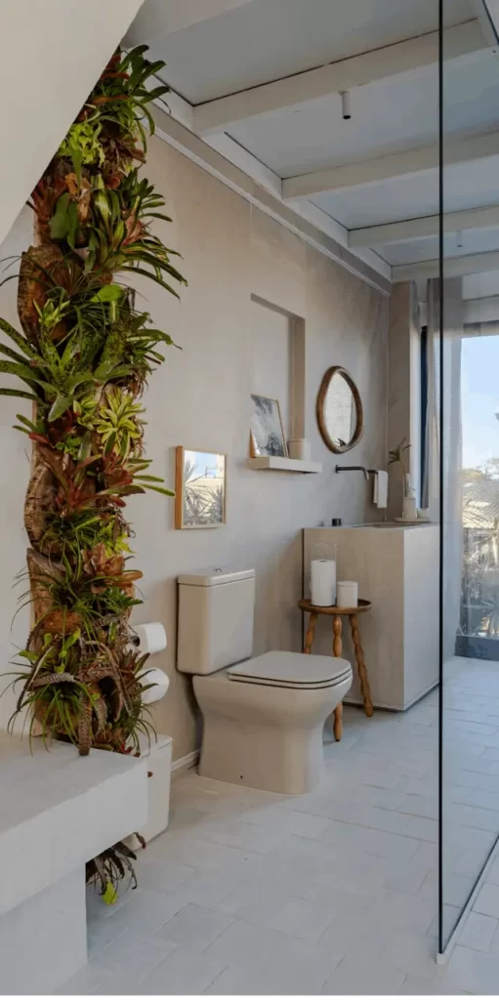
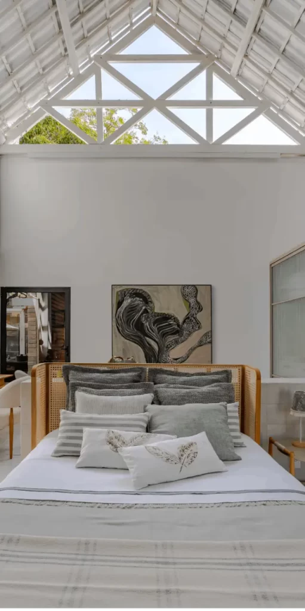
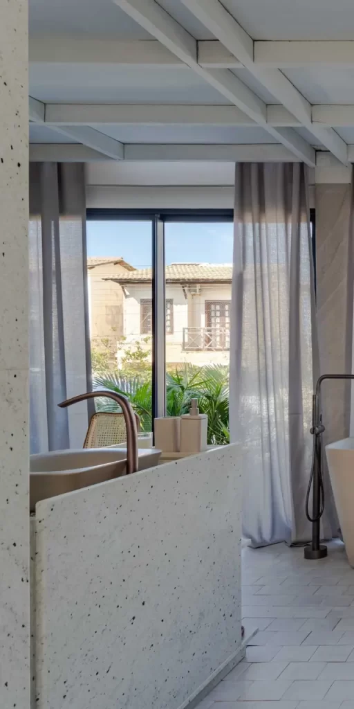
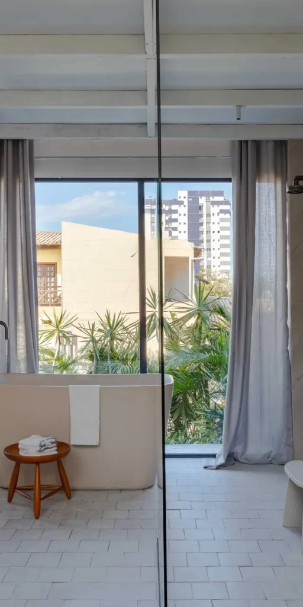
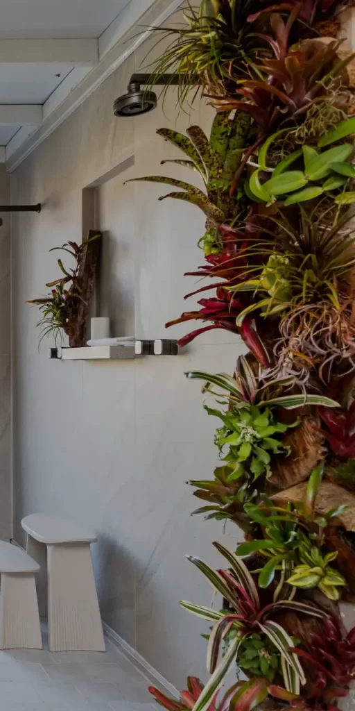
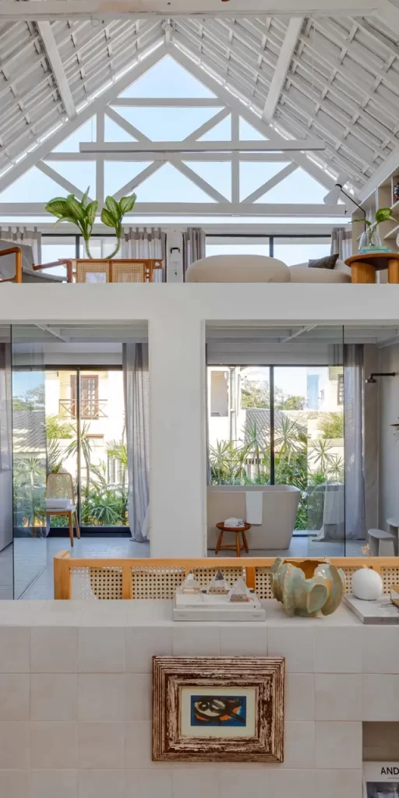

Assinado pelo arquiteto Wesley Lemos para a CASACOR Sergipe, o projeto **Estesia Deca** é um convite à reconexão com a essência do lar. Com 85 m² muito bem distribuídos entre estar, suíte, cozinha, banho e mezanino, o espaço traduz o imaginário infantil da casa ideal — um lugar de segurança, acolhimento e identidade.

A paleta em tons claros domina o ambiente, promovendo uma atmosfera de paz que favorece o equilíbrio emocional. Cada cômodo parece convidar a desacelerar, com estímulo à leitura, à meditação e ao bem-estar — valores cada vez mais buscados na arquitetura contemporânea.

Um dos grandes destaques do projeto é a **escada Santos Dumont**, um ícone do design brasileiro, que não apenas conecta os espaços, como reforça o DNA nacional do ambiente. O telhado inclinado e marcante, por sua vez, resgata a memória afetiva das casas de campo e chalés, trazendo nostalgia em cada linha.

As obras de arte selecionadas por Wesley Lemos são mais que decoração: compõem uma narrativa visual única, unindo memórias e modernidade. Linhas sutis, formas suaves e uma curadoria precisa enriquecem a experiência sensorial do espaço.

link para [mais fotos](https://casacor.abril.com.br/pt-BR/ambientes/estesia-deca-sergipe-2024)

### Realize o seu Refúgio com a Detaliê Móveis Sob Medida

A Estesia Deca é um excelente projeto para inspirar sua imaginação. Se você deseja transformar seu lar em um espaço que une funcionalidade, aconchego e estilo pessoal, conte com a **Detaliê Móveis Sob Medida**, especialista em soluções personalizadas de **móveis sob medida em Navegantes e região**.
