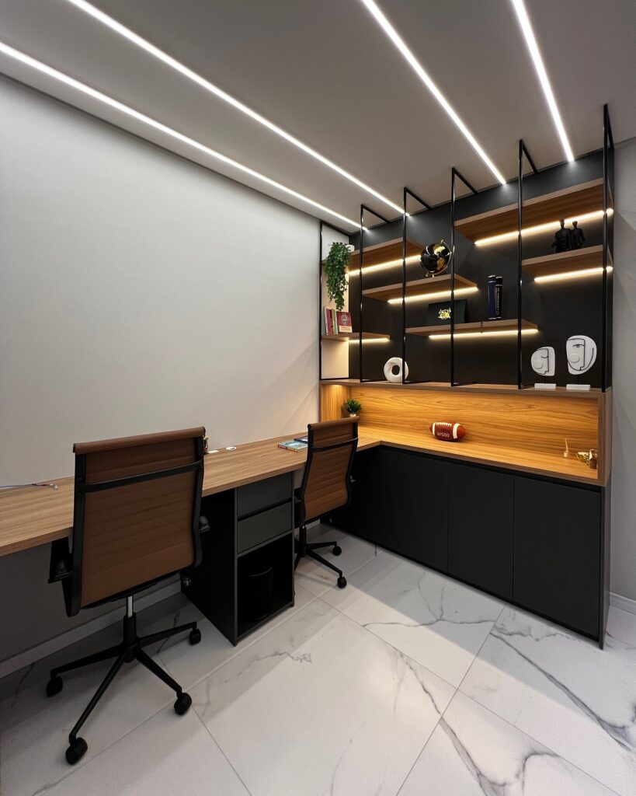

Um home office bem planejado faz toda a diferença na produtividade e no bem-estar de quem trabalha de casa. E quando o espaço é pensado com **móveis sob medida**, o resultado vai muito além da organização — ele se transforma em um ambiente funcional, bonito e inspirador.

## Marcenaria Inteligente para o Seu Dia a Dia

Uma boa marcenaria não é apenas estética — ela resolve problemas. Prateleiras bem posicionadas, gavetas com tamanhos específicos, mesas ajustadas ao seu uso diário... Tudo isso influencia diretamente sua rotina. E, claro, valoriza o imóvel.

## Trabalhar em um Espaço Feito Para Você

Cada projeto sob medida carrega a identidade de quem vai usá-lo. Seja com acabamentos neutros para manter a concentração, ou com toques de cor para estimular a criatividade, o importante é que o espaço reflita sua essência.

## Detalhes que Fazem Toda a Diferença

Iluminação embutida, pontos de energia bem distribuídos, armários com nichos personalizados e até espaços reservados para decoração... Tudo é possível quando se trabalha com marcenaria planejada por quem entende.

Esse é um excelente projeto para inspirar sua imaginação. A **Detaliê Móveis Sob Medida**, de **Navegantes**, é especialista em criar espaços funcionais e personalizados, feitos para transformar seu home office em um verdadeiro refúgio de produtividade e estilo.

* * *
